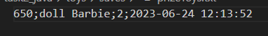
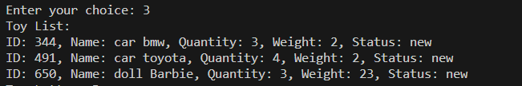

## Задание 2
 
Необходимо написать программу – розыгрыша игрушек в магазине детских товаров.
Стараемся применять ООП и работу с файлами.
Если какой-то пункт не изучали и не знаете, как сделать, то можете сделать своим способом. Например, у кого в курсе не было ООП, то применяем списки\массивы\словари
___

### Желательный функционал программы:
1.	В программе должен быть минимум один класс со следующими свойствами:
2.	id игрушки,
3.	текстовое название,
4.	количество
5.	частота выпадения игрушки (вес в % от 100)
6.	Метод добавление новых игрушек и возможность изменения веса (частоты выпадения игрушки)
___

### Возможность организовать розыгрыш игрушек.
Например, следующим образом:
С помощью метода выбора призовой игрушки – мы получаем эту призовую игрушку и записываем в список\массив.
Это список призовых игрушек, которые ожидают выдачи.
Еще у нас должен быть метод – получения призовой игрушки.
После его вызова – мы удаляем из списка\массива первую игрушку и сдвигаем массив. А эту игрушку записываем в текстовый файл.
Не забываем уменьшить количество игрушек

К написанию программы можно подойти более творчески и делать так, как Вы поняли задание. Немного менять и отходить от примера выше.
___
## РЕШЕНИЕ

Задача реализована на ЯП Java через паттерн MVP с соблюдением принципов SOLID (по возможности).

## Общий функционал
При старте программы появляется меню выбора:

### Описание команд:
1. **Add new toy** - добавляет новую игрушку в базу данных
2. **Play lottery** - проводит лотерею (при наличии игрушек в базе)
3. **View toy list** - показывает список игрушек в базе данных (при наличии игрушек в базе)
4. **Exit** - выход из программы

### ВАЖНО:
Если файл **toys.txt** с остатком игрушек на складе изначально отсутствует, *Программа* "скажет" об этом

___

### 1. Добавление новой игрушки (1. Add new toy):

При добавлении новой игрушки *Программа* "предлагает" заполнить информацию о новой игрушке в базу данных (имя - toy name, количество - toy quantity, вес игрушки (для лотереи) - weight)
Игрушке присваивается случайный Id в базе данных (от 0 до 999)

При добавлении новой игрушки добавляется запись в текстовый файл в папке ***"var1/task2_java/toys/saves/toys.txt"***

### ВАЖНО:
Если изначально файл **toys.txt** отсутствоал, *Программа* его создаст.

### 2. Розыгрыш игрушек (2. Play lottery)

Розыгрыш игрушек проводится "случайным методом", при этом вес игрушки "влияет" на шанс её выпадения.

В то же время производится запись с информацией о проведенной лотерее в отдельный файл **"var1/task2_java/toys/saves/prizeToys.txt"**

### ВАЖНО:
Если изначально файл **prizeToys.txt** отсутствоал, *Программа* его создаст.

### 3. Просмотр списка по запасам игрушек на складе (3. View toy list)

При выборе данной команды *Программа* показывает список игрушек 

### ВАЖНО:
Если файл **toys.txt** с остатком игрушек на складе изначально отсутствует, *Программа* "скажет" об этом

### 3. Выход из программы (4. Exit)

При выборе данной команды *Программа* "попрощается"

___

## ПРИЯТНОГО ПОЛЬЗОВАНИЯ!